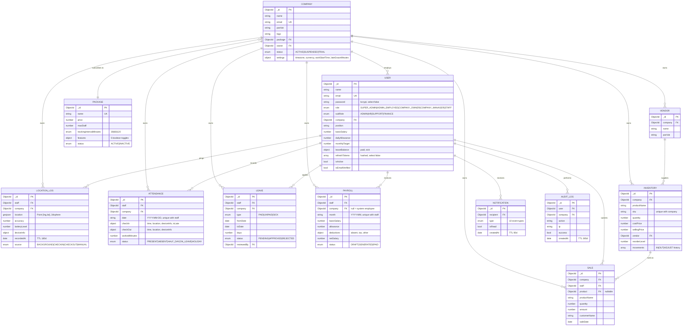

# Business Sarthi — Database ER Diagram

## Key Indexes

| Collection | Index | Purpose |
|---|---|---|
| users | `email` unique | login |
| users | `(company, role)`, `(company, isActive)` | tenant staff lists |
| locationlogs | `(staff, recordedAt desc)` | route history |
| locationlogs | `(company, recordedAt desc)` | live view / tenant export |
| locationlogs | `location 2dsphere` | geo queries / heatmap |
| locationlogs | `recordedAt` TTL 180d | volume control |
| attendance | `(staff, date)` unique | one record/day, dedupe |
| payroll | `(staff, month)` unique | one slip/month |
| sales | `(company, saleDate desc)`, `(company, staff, saleDate)` | analytics |
| inventory | `(company, sku)` unique | tenant SKU uniqueness |
| notifications | `(recipient, isRead, createdAt)` + TTL 90d | inbox |
| auditlogs | `(user/company/action, createdAt)` + TTL 365d | compliance |
